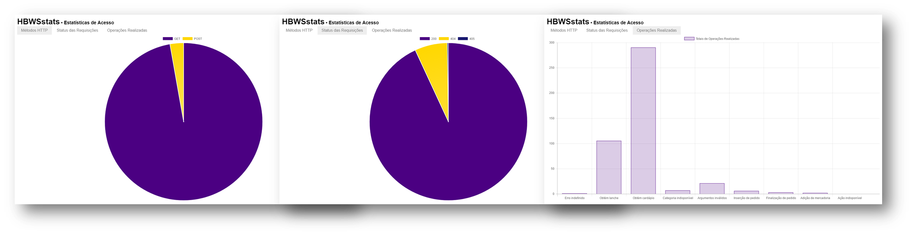

# HBWS stats

HBWS stats é um protótipo de cliente javascript para exibição de estatísticas de requisições do [HBWS](https://github.com/mpsacademico/hbws#hummm-burgueria-web-service).  
O papel desta ferramenta é estruturar graficamente os registros gerados no uso das funcionalidades do web service.  
Esse tipo de visualização facilita o acompanhamento do status e comportamento do sistema principal de um modo geral.  

O HBWS stats é um subprojeto de [HBWS](https://github.com/mpsacademico/hbws#hummm-burgueria-web-service).

## Linguagens, Ferramentas e Bibliotecas

- Javascript, HTML e CSS
- Notepad++ e Chrome Web Browser
- [Chart.js](http://www.chartjs.org/) exibe gráficos animados conforme parâmetros de entrada e configuração
- [jQuery](https://jquery.com/) auxilia na manipulação dos elementos HTML, eventos e requisições assíncronas
- [Zepto.js](http://zeptojs.com/) fornece uma alternativa ao JQuery, mais leve e com as mesmas funcionalidades

## Paleta de Cores

-  `#4B0082`
-  `#FFD700`
-  `#191970`
-  `#FF4500`

## Referências

http://www.flaticon.com/free-icon/pie-chart_134473  
Icons made by <a href="http://www.flaticon.com/authors/madebyoliver" title="Madebyoliver">Madebyoliver</a> from <a href="http://www.flaticon.com" title="Flaticon">www.flaticon.com</a> is licensed by <a href="http://creativecommons.org/licenses/by/3.0/" title="Creative Commons BY 3.0" target="_blank">CC 3.0 BY</a>
